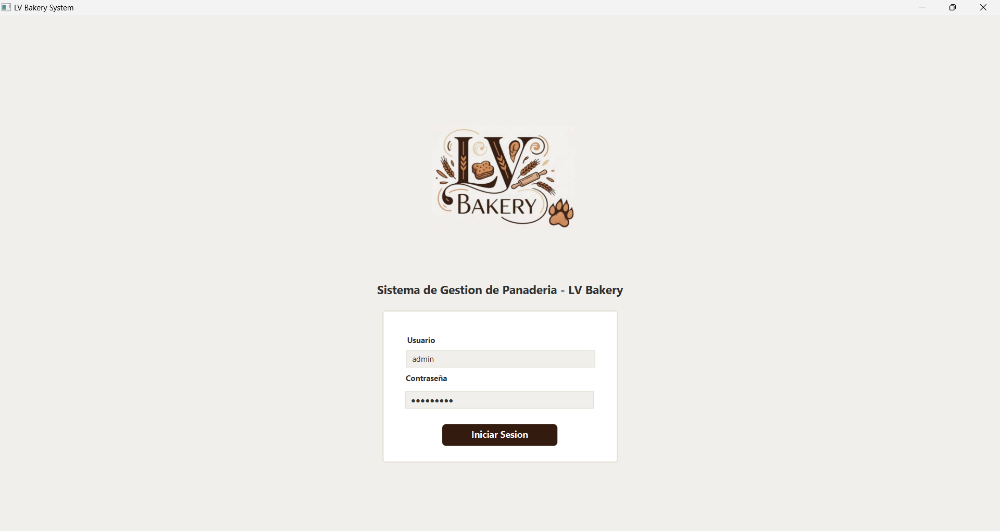
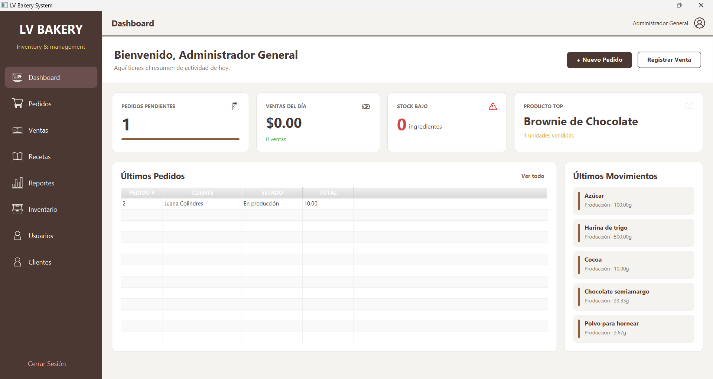
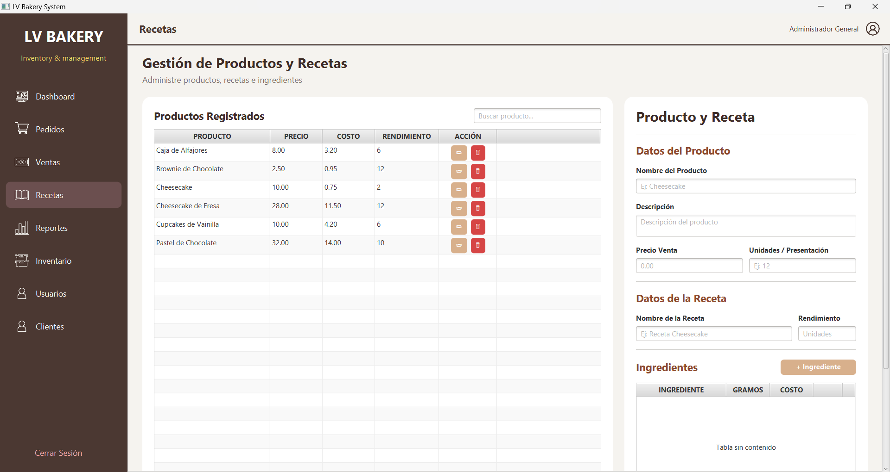
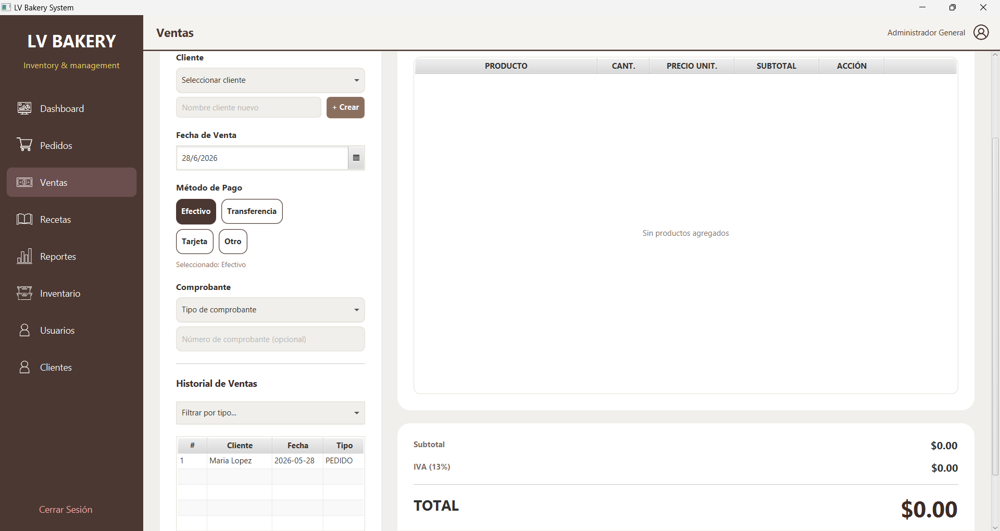
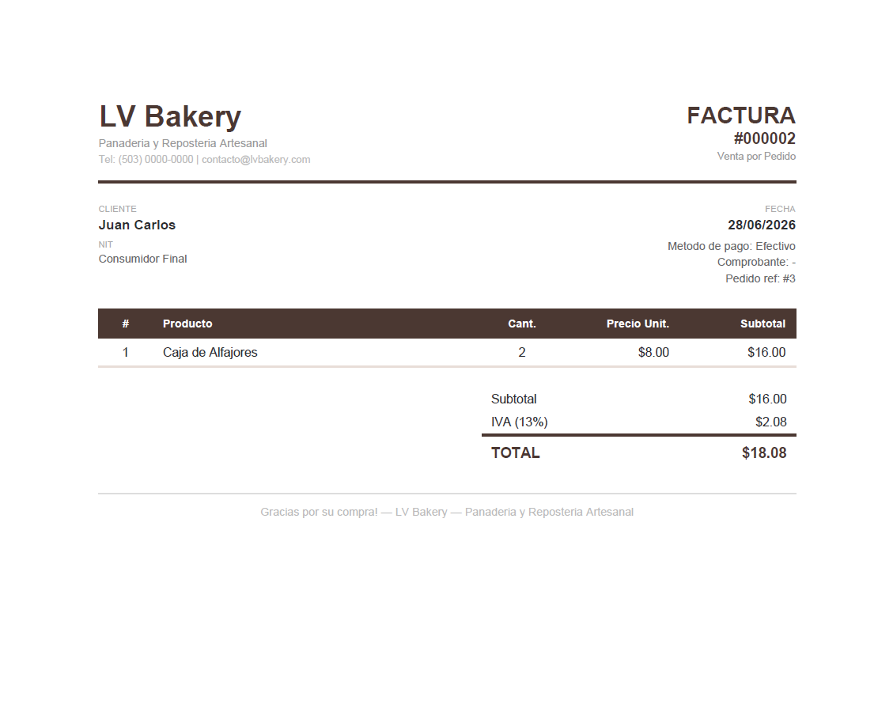

# 🥖 LV Bakery System

Sistema de gestión para panadería desarrollado con JavaFX y PostgreSQL, diseñado para digitalizar procesos administrativos y operativos como ventas, inventario, usuarios y facturación.

El proyecto fue desarrollado para una panadería real, permitiendo mejorar el control de productos, ventas y generación de documentos comerciales.

---

## 🚀 Características Principales

* Gestión de productos y categorías
* Control de inventario
* Registro de ventas
* Administración de usuarios
* Sistema de autenticación
* Generación automática de facturas PDF
* Interfaz gráfica desarrollada con JavaFX
* Persistencia de datos mediante PostgreSQL

---

## 🛠️ Tecnologías Utilizadas

* Java 17
* JavaFX
* PostgreSQL
* Maven
* CSS
* OpenHTMLtoPDF
* Git & GitHub

---

## 🗄️ Base de Datos

La aplicación utiliza PostgreSQL para almacenar la información del negocio.

Principales entidades:

* Usuarios
* Productos
* Categorías
* Ventas
* Detalles de Venta
* Inventario

La base de datos fue diseñada siguiendo principios de normalización para garantizar integridad y consistencia de los datos.

---

## 👥 Equipo de Desarrollo

Proyecto desarrollado en colaboración.

### Mi Participación (Douglas León)

* Diseño de interfaces gráficas utilizando JavaFX.
* Desarrollo de la mayoría de los módulos funcionales del sistema.
* Integración de componentes desarrollados por el equipo.
* Corrección de errores y pruebas funcionales.
* Coordinación de tareas y seguimiento del desarrollo.
* Implementación y validación del sistema de generación de facturas PDF.
* Apoyo en el diseño y validación de la base de datos.

---

## 📷 Capturas del Sistema

### Inicio de Sesión



### Menú Principal



### Gestión de Productos



### Registro de Ventas



### Facturación PDF



---

## 📚 Documentación

La documentación del proyecto se encuentra disponible en la carpeta `/docs`.

* Manual de Usuario
* Manual del Analista
* Manual del Desarrollador

---

## ⚙️ Requisitos

* Java 17
* PostgreSQL 15 o superior
* Maven

---

## 🔧 Configuración

Crear la base de datos:

```sql
CREATE DATABASE lv_bakery;
```

Ejecutar el script:

```text
database/lv_bakery.sql
```

---

## ▶️ Ejecución

```bash
java -jar LVBakery.jar
```

---

## 🎯 Objetivos de Aprendizaje

Este proyecto permitió aplicar conocimientos relacionados con:

* Programación Orientada a Objetos
* Desarrollo de Aplicaciones de Escritorio
* Diseño de Bases de Datos Relacionales
* Integración de Sistemas
* Generación de Documentos PDF
* Trabajo Colaborativo mediante Git y GitHub

---

## 🔮 Mejoras Futuras

* Implementación de contraseñas cifradas mediante hash.
* Gestión avanzada de roles y permisos.
* Reportes estadísticos.
* Respaldo automático de base de datos.
* Despliegue en entorno multiusuario.
